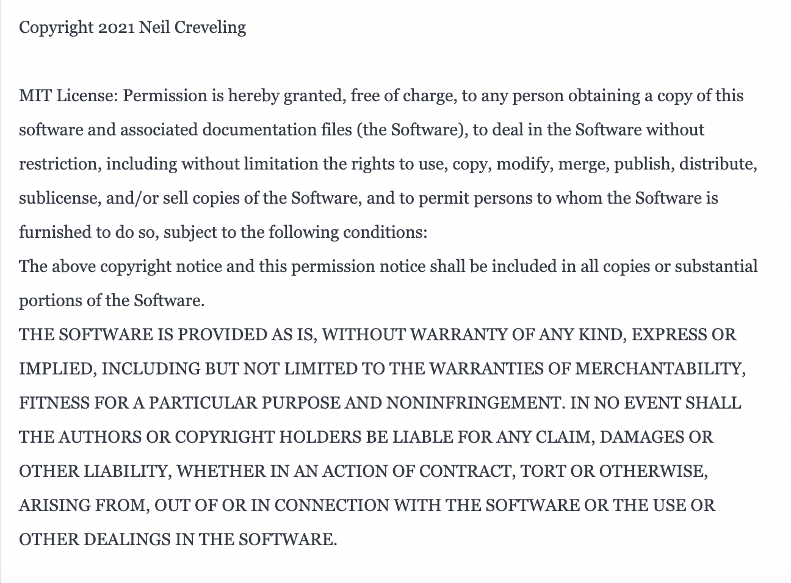

# Professional-README-Generator
You can quickly and easily create a README file by using a command-line application to generate one. This allows the project creator to devote more time to working on the project.

## About

This application allows developers to quickly and efficiently create professional README.md files using the command line. Using the Inquirer package, users are prompted with questions pertaining to the project. With these answers, the application will generate an organized README.md file, giving them more time and energy to focus on the development process.

## Application

This application is run completely through the command-line.

Features include:

* Prompts for name, year, title, description, installation, instructions, usage information, contribution guidelines, and test instructions
* Adds proper badge to top of generated README.md based upon user response
* Adds proper license description to generated README.md based upon user response
* Github username submitted by user includes a link to the user's Github profile

Below, there is a video walkthrough of the functionality of the application. There are also screenshots of the final terminal result, and the final appearence of the sample README.md in its entirety.

[Walkthrough Link](https://www.youtube.com/watch?v=_Sk4pNNajqE)

## License

MIT License

Copyright (c) 2021 Neil Creveling

Permission is hereby granted, free of charge, to any person obtaining a copy of this software and associated documentation files (the "Software"), to deal in the Software without restriction, including without limitation the rights to use, copy, modify, merge, publish, distribute, sublicense, and/or sell copies of the Software, and to permit persons to whom the Software is furnished to do so, subject to the following conditions:

The above copyright notice and this permission notice shall be included in all copies or substantial portions of the Software.

THE SOFTWARE IS PROVIDED "AS IS", WITHOUT WARRANTY OF ANY KIND, EXPRESS OR IMPLIED, INCLUDING BUT NOT LIMITED TO THE WARRANTIES OF MERCHANTABILITY, FITNESS FOR A PARTICULAR PURPOSE AND NONINFRINGEMENT. IN NO EVENT SHALL THE AUTHORS OR COPYRIGHT HOLDERS BE LIABLE FOR ANY CLAIM, DAMAGES OR OTHER LIABILITY, WHETHER IN AN ACTION OF CONTRACT, TORT OR OTHERWISE, ARISING FROM, OUT OF OR IN CONNECTION WITH THE SOFTWARE OR THE USE OR OTHER DEALINGS IN THE SOFTWARE.
